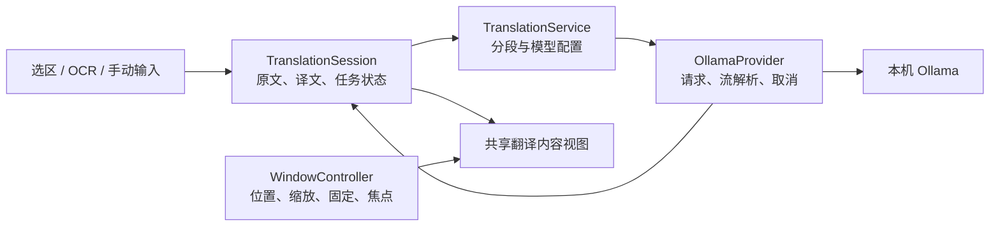

**LingoFlow 重构调研与实施规划 · 2026-09-26**

建议先保留 Python＋PyQt6，集中重构窗口交互、长文本处理和翻译任务生命周期。对于个人自用、只支持 macOS 的目标，这条路线能复用现有实现，直接解决当前痛点。Swift＋SwiftUI/AppKit 是后续原生化的候选；先用一个小原型验证窗口与系统集成，再决定是否迁移整个应用。

本次结论来自本地源码、现有自动测试、少量隔离复现，以及公开 GitHub 仓库与关键源码。基线提交为 `f39985f2ede8841dcd9f6cef2d1f04cce7183acc`，最后提交日期为 2026-05-26；开始检查时工作区干净。应用源代码共 29 个 Python 文件、约 6457 行，包含注释和空行。

实施进度（2026-09-26）：M1 中的选区和流式阅读修复已落地。新译文通过独立末尾光标追加，保留读者光标、选区方向和范围；选词或向上阅读时停止跟随，清除选区并滚回底部后恢复跟随。原文固定按纯文本显示，保留 `<b>…</b>` 等字面内容。新增 14 项回归用例，全套 73 项通过，Qt Cocoa 原生后端的 15 项弹窗用例通过，Ruff 检查通过。Cocoa 测试需要在受限沙箱外运行；使用临时配置并禁用全局事件监听，不涉及真实 Ollama 推理或系统权限修改。下方问题表保留调研时的证据，拖动/缩放、5000 字符截断、流协议完成状态及朗读仍按后续步骤实施。

本次交付已在开发环境（PyQt6 6.11.0）及打包环境（PyQt6 6.10.2）分别通过同一套 73 项回归测试和 15 项 Cocoa 弹窗测试。已使用现有 PyInstaller 6.20.0 生成 [选区修复测试版 LingoFlow.app](/Users/shoucong/Desktop/Projects/Lingoflow/dist/selection-fix-20260926/LingoFlow.app)，构建日志位于 [selection-fix-20260926.log](/Users/shoucong/Desktop/Projects/Lingoflow/build/selection-fix-20260926.log)，深度严格签名校验通过。此包为 arm64、ad-hoc 本地签名测试包，未替换已安装的应用；测试时应先退出正在运行的旧版，避免单实例机制唤起旧进程。真实模型、全局快捷键、安装后的权限及人工鼠标操作仍按 [手工验收清单](/Users/shoucong/Desktop/Projects/Lingoflow/manual_tests/README.md) 核验。

调研期间只新增本规划与 GitHub 元数据快照。没有修改应用源码，没有安装对标应用，没有启动真实模型推理，也没有更改系统权限或签名。自动测试的配置、日志及缓存路径被重定向到临时目录。以下“复现”均指离屏 Qt 或模拟 HTTP 环境，不能替代真实 macOS 窗口验收。

**当前仓库的基础值得保留。** 5 月的工作已经引入 `TranslationWorkflow`、`OCRWorkflow`、`SettingsCoordinator`、`TrayController`、`AppStateTracker` 和副作用接口，也有配置校验、原子保存、旧配置迁移、单实例、截图清理及 macOS 打包脚本。本次重新运行现有测试，结果为 **59 passed in 1.29s**。测试主要保护服务与流程，弹窗专门测试只有一项，未覆盖拖动、缩放、文本选择和系统焦点。

目前主实现已采用 Quartz 快捷键、AppKit 剪贴板和 Apple Vision OCR。源码检索未发现仍在维护的 Windows 后端。剩余的平台判断、测试替身及忽略规则，不应一概当成需要删除的 Windows 功能。此前私有规划面向“其他用户也能安装使用”，本规划按这次明确的“个人自用、仅 macOS”缩小范围。

**需要优先处理的具体问题如下。**

| 优先级 | 发现与证据级别 | 对使用的影响 | 代码位置与处理方向 |
| --- | --- | --- | --- |
| P0 | 无系统边框，未实现拖动或交互缩放；源码确认 | 无法调整窗口位置与大小 | [popup.py:115](/Users/shoucong/Desktop/Projects/Lingoflow/src/lingoflow/ui/popup.py:115)。先使用带系统装饰、可缩放的窗口；若保留无边框外观，补齐明确的拖动区域和缩放操作。 |
| P0 | 最大尺寸为 500×400；源码及离屏实例确认 | 长文被限制在很小的阅读区域 | [constants.py:108](/Users/shoucong/Desktop/Projects/Lingoflow/src/lingoflow/config/constants.py:108)。改为合理最小尺寸与当前屏幕可用区域上限，保存用户尺寸。 |
| P0 | 每个流式块都强制滚到底部；源码确认 | 向上阅读时被持续拉回末尾 | [popup.py:430](/Users/shoucong/Desktop/Projects/Lingoflow/src/lingoflow/ui/popup.py:430)。仅在用户原本接近底部时跟随输出，提供“回到最新”。 |
| P0 | 流式追加依赖当前文本光标；隔离复现 | 点击或选择已有译文后，新内容可能插到中间，显示内容与复制内容不一致 | 同上。实验先写入 `ABC`、将光标移至开头、再写入 `DEF`，显示为 `DEFABC`，内部结果仍为 `ABCDEF`。使用独立末尾光标写入，保留用户选区。 |
| P0 | 选区超过 5000 字符直接截断；源码确认 | 用户可能以为完整翻译了全文 | [translation_workflow.py:93](/Users/shoucong/Desktop/Projects/Lingoflow/src/lingoflow/ui/translation_workflow.py:93)。保存完整原文；超限明确提示或按段处理。OCR 入口也应走同一长度策略。 |
| P0 | HTTP 200 流缺失结束标志或只含错误帧时，被当成正常结束；隔离复现 | 部分译文或空结果可能显示成功 | [ollama_client.py:178](/Users/shoucong/Desktop/Projects/Lingoflow/src/lingoflow/infrastructure/ollama_client.py:178)、[translation_workflow.py:145](/Users/shoucong/Desktop/Projects/Lingoflow/src/lingoflow/ui/translation_workflow.py:145)。校验错误帧、结束标志和结束原因，区分完成、截断、失败和取消。 |
| P1 | 快捷键入口在主线程同步调用 Ollama 探活和选区采集；源码确认，卡顿程度未实测 | 服务响应慢时，界面可能卡住 | [main_window.py:283](/Users/shoucong/Desktop/Projects/Lingoflow/src/lingoflow/ui/main_window.py:283)、[translation_workflow.py:73](/Users/shoucong/Desktop/Projects/Lingoflow/src/lingoflow/ui/translation_workflow.py:73)。探活走后台或缓存；采集按 AppKit/Accessibility 的线程要求设计，等待使用异步状态。 |
| P1 | 取消主要检查标志，等待下一行网络响应时才检查；源码确认 | UI 已显示取消，底层请求仍可能等待 | [ollama_client.py:174](/Users/shoucong/Desktop/Projects/Lingoflow/src/lingoflow/infrastructure/ollama_client.py:174)、[tasks.py:66](/Users/shoucong/Desktop/Projects/Lingoflow/src/lingoflow/infrastructure/tasks.py:66)。保留现有任务 ID 过滤，再增加可终止传输的取消句柄。 |
| P1 | 主流程状态、任务状态、服务取消标志和窗口标志并存 | 状态边界不清时容易出现关闭后回弹、旧请求干扰新请求 | [app_state.py:74](/Users/shoucong/Desktop/Projects/Lingoflow/src/lingoflow/core/app_state.py:74)、[popup.py:648](/Users/shoucong/Desktop/Projects/Lingoflow/src/lingoflow/ui/popup.py:648)。统一会话状态来源，窗口显示状态单独管理；本轮未复现所有焦点边界。 |
| P1 | 原生外部点击回调未读取 `hide_on_focus_loss`；源码确认 | 关闭自动隐藏设置后，仍可能被外部点击关闭 | [popup.py:537](/Users/shoucong/Desktop/Projects/Lingoflow/src/lingoflow/ui/popup.py:537)。收敛外部点击、失焦、固定模式的判断，并在真实 App 中验收。 |
| P1 | 选区采集清空剪贴板、等待固定时间、模拟复制后无条件恢复；源码确认 | 慢应用可能采集失败；期间新复制的内容可能被覆盖 | [clipboard.py:54](/Users/shoucong/Desktop/Projects/Lingoflow/src/lingoflow/infrastructure/clipboard.py:54)。优先尝试 Accessibility 选区读取，失败时使用有超时与 `changeCount` 检查的剪贴板回退。 |
| P2 | 完成任务仍保存在任务字典中；源码确认 | 常驻运行会不断保留任务记录 | [tasks.py:100](/Users/shoucong/Desktop/Projects/Lingoflow/src/lingoflow/infrastructure/tasks.py:100)。任务结束后释放活动引用，只保留有界诊断记录；本轮未测量内存增长。 |
| P2 | 部分设置没有完整兑现 | 设置界面与实际行为不一致 | `theme` 已有配置但弹窗样式固定为深色；`enhance_image` 已有配置，但当前 `extract_text()` 直接调用 Vision。实现选项或移除尚未生效的入口。 |

这批问题显示，下一轮应同时处理阅读体验和结果正确性。仅放大弹窗会留下截断、错位追加和错误完成状态。

**GitHub 对标以三个较大项目为主，再补充两个技术参照。** 下表 star 数来自 2026-09-26 的公开 API 快照，是规模线索，不是稳定性评分。最近提交指默认分支 HEAD 的提交日期；发行版与开发分支可能不同。原始字段、提交 SHA 和查询链接保存在 [GitHub 快照](/Users/shoucong/Desktop/Projects/Lingoflow/docs/research/github_snapshot_2026-09-26.json)。

| 项目 | 规模与维护快照 | 技术栈与本地模型接入 | 对 LingoFlow 的参考价值 |
| --- | --- | --- | --- |
| [Easydict](https://github.com/tisfeng/Easydict) | 14,754 stars；未归档；默认分支 `dev` 最近提交 2026-09-25；最新正式 release 2.22.0，2026-08-23 | Swift＋Objective-C；AppKit 窗口、部分 SwiftUI 页面；独立 Ollama 服务 | 首要参考：macOS 划词/OCR、可缩放窗口、固定模式、窗口位置管理和服务配置。 |
| [NextAI Translator](https://github.com/nextai-translator/nextai-translator) | 24,986 stars；未归档；最近提交 2026-09-03；v0.6.43，2026-08-23。旧 `openai-translator` 地址已重定向至此 | React＋TypeScript＋Tauri 2；Ollama 经兼容端点接入 | 参考模型适配、翻译操作组织、窗口尺寸记忆和固定/失焦行为。其浏览器与多平台范围比你的需求大。 |
| [Pot](https://github.com/pot-app/pot-desktop) | 19,416 stars；**2026-09-07 已归档**；最近提交 2026-07-04；3.0.7，2025-05-10 | React＋JavaScript/TypeScript＋Tauri 1；直接使用 Ollama 客户端 | 参考拖动区域、固定按钮、尺寸/位置保存和翻译服务拆分。适合作为设计资料，后续维护不能依赖原仓库。 |
| [translateLocally](https://github.com/XapaJIaMnu/translateLocally) | 631 stars；未归档；默认分支最近提交 2025-03-30；API 未返回 latest 正式 release | C++＋Qt，Marian/Bergamot 本地机器翻译 | 补充参考：专用小翻译模型、桌面 GUI 与引擎分离。它不是 Ollama/7B 聊天模型路线；未核验当前中英模型覆盖和翻译质量。 |
| [Transly](https://github.com/vlr-code/transly) | 1 star；最近提交及 v1.0 发布均为 2026-05-30 | Swift＋AppKit＋MLX；模型在 Apple Silicon 本机执行 | 小型技术样例：原生浮窗及可替换翻译引擎。成熟度证据不足，不能与前三者并列为成熟产品推荐。 |

前三个应用既能接入本地模型，也有在线服务。支持 Ollama 不代表默认配置就是完全离线。例如 Easydict 的当前服务文档列出新安装默认启用有道、DeepL 和内置 AI；做本地对照时应只启用本机 Ollama 服务。[Easydict 服务说明](https://github.com/tisfeng/Easydict/blob/eedc893918b976d8454f682d6eaae576758b3481/docs/user-docs/en/SERVICES.md)

从源码中可以直接借鉴的做法是：

- Easydict 将移动、缩放、固定以及窗口位置更新交给独立窗口层；非主窗口与主窗口采用不同激活策略。对应 [EZBaseQueryWindow](https://github.com/tisfeng/Easydict/blob/eedc893918b976d8454f682d6eaae576758b3481/Easydict/objc/ViewController/Window/BaseQueryWindow/EZBaseQueryWindow.m)。这是 LingoFlow 窗口行为的主要参照；复杂度应按自用需求缩小。
- Easydict 的 [OllamaService](https://github.com/tisfeng/Easydict/blob/eedc893918b976d8454f682d6eaae576758b3481/Easydict/Swift/Service/Ollama/OllamaService.swift) 单独负责端点和模型枚举。LingoFlow 已有 `LLMProvider` 接口，可沿现有边界继续拆分。
- Pot 的 [翻译窗口](https://github.com/pot-app/pot-desktop/blob/594d32ede96acd106b0256deaa8bb440ffcdff40/src/window/Translate/index.jsx) 有拖动区域、固定状态和尺寸/位置持久化；[Ollama 适配器](https://github.com/pot-app/pot-desktop/blob/594d32ede96acd106b0256deaa8bb440ffcdff40/src/services/translate/ollama/index.jsx) 与 UI 分开。可参考这两处职责，不引入其完整插件系统。
- NextAI 的 [窗口实现](https://github.com/nextai-translator/nextai-translator/blob/a9681a4ab0599bef7013e29fca701f250d7738a2/src/tauri/windows/TranslatorWindow.tsx) 将固定状态与失焦隐藏结合；[Ollama 适配器](https://github.com/nextai-translator/nextai-translator/blob/a9681a4ab0599bef7013e29fca701f250d7738a2/src/common/engines/ollama.ts) 有模型驻留与推理模式的处理。其模型枚举仍含较旧的静态名单，LingoFlow 应保留已有的本机模型查询能力。
- Transly 的 [窗口控制器](https://github.com/vlr-code/transly/blob/b3444f2fd1ffe50e9df7db952148e0f3b694b028/transly/App/TranslationWindowController.swift) 用一个可拖动、可缩放的面板支持不同打开方式，并在已打开时保留用户调整的位置。可用来构思小型原型；其较大的单个控制器不宜照搬。

若参考源码而非仅参考交互，记录各项目许可证及文件来源：Easydict/Pot 为 GPL-3.0，NextAI 为 AGPL-3.0，其余两者为 MIT。此处只列仓库元数据；本规划不复制第三方实现。

**Python 是否更换，应由维护和交互成本决定。** 当前 Python 应用通过 HTTP 调用独立的 Ollama 进程。模型大小、量化、上下文和模型冷启动影响推理表现；GUI 语言的改变不会直接改变模型翻译能力。界面是否卡顿、常驻内存与启动耗时则需要各自测量，本轮没有进行真实性能比较。

| 路线 | 能复用什么、需要付出什么 | 建议 |
| --- | --- | --- |
| Python＋PyQt6，继续使用 PyObjC 和 Ollama | 复用现有服务、测试、OCR、权限与打包；补齐 Qt 窗口和原生事件边界 | **下一轮默认路线。** 足以实现拖动、缩放和长文阅读，改动能直接落在已识别问题上。 |
| Swift＋SwiftUI 内容界面＋AppKit 窗口＋Ollama | 原生窗口和系统 API 集中在一个技术体系；需要重建 UI、配置迁移、异步网络、错误处理、测试和打包 | 长期原生化候选。先验证一个完整使用流程，再承担全量迁移成本。 |
| Tauri＋React＋Rust | 成熟前端布局和跨平台工具；引入额外语言和桌面桥接，macOS 权限/窗口仍要处理 | 当前不优先。你已经明确不需要 Windows；只有明显偏好 Web UI 开发时再考虑。 |
| Swift 外壳＋常驻 Python 子进程 | 可暂时复用部分 Python；增加进程通信、双套生命周期、打包和诊断 | 当前业务主要是调用 Ollama/Vision，长期保留两套运行时收益有限。 |
| 直接在应用内嵌入 MLX 或其他推理引擎 | 可自行管理模型；也必须承担下载、校验、内存、取消和版本兼容 | 与 GUI 重构分开评估。先保留现有 Ollama。 |

Qt 已提供系统移动与缩放入口，但文档明确其行为依赖平台支持。当前轮次优先尝试系统装饰的可缩放窗口；保留自绘边框时，要验证实际 Qt/macOS 组合并设计回退，不能只添加 API 调用就宣布完成。[Qt QWindow 文档](https://doc.qt.io/qt-6/qwindow.html#startSystemMove)

若选择 Swift，AppKit 负责 `NSPanel/NSWindow` 的激活、层级和焦点，SwiftUI 负责内容及设置。这里仍需实际验证“首次显示不抢焦点、点击后可选字/复制/编辑、退出返回原应用”之间的关系，原生技术栈不会自动替你定义这些规则。[Apple NSPanel 文档](https://developer.apple.com/documentation/appkit/nspanel)

**产品范围应围绕两个阅读场景组织。** 快速查一句与持续读长段，共享同一份原文、译文和任务状态，窗口策略不同。

| 行为 | 快速浮窗 | 固定阅读模式 |
| --- | --- | --- |
| 打开位置 | 首次靠近鼠标，限制在当前显示器可用区域 | 使用保存的位置和尺寸；显示器移除后回到可见区域 |
| 移动与缩放 | 均支持；标题区域拖动不影响选字 | 均支持；长文可使用较大区域 |
| 原文展示 | 默认折叠长原文，允许展开 | 原文/译文可调比例，提供完整原文编辑或校正 |
| 失焦 | 未固定且完成后可隐藏，行为服从设置 | 保持显示；置顶为明确可选状态 |
| 流式阅读 | 用户停在底部时跟随，向上滚动后停止跟随 | 同左；不因新块到达而抢焦点 |
| 停止与关闭 | 明确停止按钮；关闭或 Esc 取消当前请求 | 停止保留部分结果；关闭取消，最小化保留会话 |
| 重试与新选区 | 重试当前原文；再次触发时取消旧请求并处理新请求 | 首版只支持一个活动会话，不引入复杂队列 |
| 复制 | 复制选区与复制全文行为区分清楚 | 原文、译文、双语分别复制 |

实现上先让一个窗口具备“快速/固定阅读”两种模式即可；存在明确的独立窗口需要时再分成两种宿主，共享内容组件。优先使用可调分隔布局和适合长文的文本控件，避免将完整原文长期塞在不可滚动的 `QLabel` 中。

**架构调整沿现有接口推进。** `MainController` 保留装配职责；业务会话离开窗口对象，macOS 实现集中，模型请求与提示词策略分开。下图是目标职责关系，不要求一次性重建全部目录。

| 当前边界 | 下一步整理 |
| --- | --- |
| `ui/translation_workflow.py` 同时管任务和窗口 | 保留协调入口，抽出 `TranslationSession`；原文、完整译文、请求 ID、结果状态从会话读取。窗口只展示和发送用户操作。 |
| `core/ports.py` 已有接口，但引用具体 hotkey/OCR 模块中的类型 | 将数据类型移到独立模块；接口不因导入而依赖 macOS 实现或 Qt。延续当前接口，避免另建重复框架。 |
| `core/hotkey.py`、`core/ocr.py` 与系统实现混放 | 在改动相关功能时，逐步归入 `infrastructure/macos/`；分开截图和 Vision 识别，保留当前成熟路径。 |
| `TranslationService` 直接构造 `OllamaClient` | 支持注入 provider；将模型参数和提示词打包为配置。第二种真实后端有需要时再接入。 |
| `popup.py` 同时负责内容、系统监听和关闭规则 | 拆成窗口控制、内容视图和少量原生桥接；统一管理监听器注册与释放。 |
| 应用状态、窗口状态和服务取消状态交错 | 会话负责任务状态；窗口负责可见/固定/焦点；provider 负责传输资源。沿用已有请求 ID 防止旧事件回写。 |
| 打包依赖主要写成最低版本 | 在已验证环境上记录 Python/Qt/PyObjC/打包器版本，增加可复现依赖约束，验证重新安装后的 `.app`。 |

任务状态至少区分 `Acquiring → Recognizing（如需）→ Translating → Completed / Failed / Cancelled`。部分结果应保留，但不能标成完整成功。取消先使当前请求失效，再关闭该请求的网络资源，最后回收任务；这些步骤与用户调整窗口大小没有关联。

**新增需求：单词发音与离线朗读。** 将它安排在 M1 之后、M2 之前，作为一个小版本交付。先修好文本选区、流式写入和窗口行为，再接入发音，不必等全部重构完成。该功能独立于翻译模型，不要求更换 Python 或下载另一套大模型。

首版优先支持“朗读原文”以及“朗读选中的词/句子”。原文有选区时只播放选区，没有选区时播放完整原文；按钮提示明确显示当前动作。选区需在点击按钮导致焦点变化前保存，并形成不可变播放文本快照。译文朗读使用独立按钮，复用相同服务；首版可在译文完成后开放整段朗读，避免持续排队播放流式碎片。默认点击后播放，不自动出声。

| 交互 | 首版约定 |
| --- | --- |
| 单词发音 | 原文区域旁放朗读按钮；选中单词后也可通过右键“朗读所选内容”触发。无需等待翻译完成。 |
| 原文与译文 | 分开入口、分开选择语言，避免英文原词因中文翻译目标而使用中文声音。 |
| 语言与口音 | 先覆盖英语与中文；支持已安装的美式/英式英语声音和语速。优先明确的原文语言；源语言为 auto 时允许使用用户默认发音语言并手动切换，不依赖单个词的自动识别。 |
| 播放控制 | 再点当前播放按钮即停止；播放新内容先停止旧内容，始终最多一条语音。首版只做播放/停止。 |
| 生命周期 | 关闭窗口、切换到新翻译会话或退出应用时停止；正常失焦是否隐藏仍遵循窗口模式。隐藏快速浮窗时也停止，固定阅读模式继续遵循其显示规则。 |
| 无可用声音 | 显示缺少相应语言声音，提供系统声音设置指引；不静默改用错误语言。 |

Python 首版建议采用 `SpeechService → MacOSSpeechBackend → /usr/bin/say`。用 Qt 的 `QProcess` 异步启动并监听完成/错误信号；通过标准输入传文本，不拼接 shell 命令、不在 UI 线程等待进程退出、不生成临时音频文件。服务持有并回收自己的进程，停止旧进程完成后再启动最新请求，防止声音重叠和迟到回调覆盖按钮状态。[Qt QProcess 文档](https://doc.qt.io/qt-6/qprocess.html)

接口只需要可用声音查询、播放、停止和状态通知；播放状态独立于翻译忙闲状态。现有 [HotkeyAction.PRONOUNCE](/Users/shoucong/Desktop/Projects/Lingoflow/src/lingoflow/core/hotkey.py:28) 只是预留枚举，本轮源码检索未找到对应服务或按钮；首版先完成界面入口，有需要时再配置全局快捷键。

使用已下载的系统声音实现离线播放。新声音可能需要先从 Apple 下载，安装完成后再供应用选择。后续需要暂停/继续、逐词高亮等能力时，可以在相同接口后换成 PyObjC 调用 `AVSpeechSynthesizer`；迁移 Swift 时也可直接使用该 API。[Apple 系统声音设置](https://support.apple.com/guide/mac-help/change-the-voice-your-mac-uses-to-speak-text-mchlp2290/mac)、[Apple 语音合成接口](https://developer.apple.com/documentation/avfaudio/avspeechsynthesizer)

2026-09-26 本机检查：`say -v '?'` 成功，能枚举英式、美式英语和中文声音；项目虚拟环境未安装 AVFoundation/AVFAudio 的 Python 桥接模块。本轮仅做声音枚举，未播放试听、未下载声音、未更改设置。采用 `say` 可以先复用现有 Python/Qt 环境。

系统 TTS 可满足首版听词需求；同形异音词或专业词的发音仍需结合词性和语境。若日后要求词性对应音标、字典录音或多个读音解释，再单独增加词典模块，并核对数据来源与使用方式。

**模型优化可以保留为独立工作流。** 仓库默认翻译模型是 `huihui_ai/hunyuan-mt-abliterated:7b-chimera`，另有 `gemma3:4b` 用于其他任务；这只是 [默认配置](/Users/shoucong/Desktop/Projects/Lingoflow/src/lingoflow/config/constants.py:55)，本次未读取用户实际配置，也未验证当前 Ollama 加载的模型。

下一步先记录现有模型的准确 tag/digest、量化、上下文和提示词，再比较少量候选。每个模型配置应包含模型名、适配提示词、输入/输出预算、生成参数、思考能力、驻留策略和超时。能力相关参数要查询所用 Ollama/模型实际支持情况；流式结束信息也应进入会话状态。[Ollama Chat API](https://docs.ollama.com/api/chat)

建议用 30–50 段日常文本作为固定评测集，覆盖短句、论文长句、术语、否定关系、数值/单位、引用、公式邻接文本和 OCR 断行。比较首字延迟、总耗时、冷/热启动、完整性及人工译文质量，保留同一模型的原有配置作基线。4B 或其他 7–8B 模型是否更适合，应由目标 Mac 上的质量和速度决定。

长文先保证完整，再按模型预算沿段落切分；固定字符数不能准确代表 token 预算。分段时保留段落编号和必要上下文，允许只重试失败段；不要把逐段摘要当成翻译，也不要无提示丢弃后半段。术语表与学术提示词在此后加入，避免在不稳定的结果链路上扩大功能。

**建议按以下里程碑实施，每一步都交付可使用的版本。**

| 顺序 | 交付范围 | 完成条件 |
| --- | --- | --- |
| M0：建立使用基线 | 保留当前可运行版本、测试结果与配置格式；整理常用应用中的复现清单；用相同本地模型、相同文本对照 Easydict | 能区分“模型质量问题”和“应用交互问题”；明确目标 macOS、芯片/内存及是否常用多屏。对标应用安装与真实操作留待实施阶段。 |
| M1：窗口与结果完整性 | 拖动、缩放、记忆尺寸、固定阅读；修复强制滚动与光标错位；处理 5000 字符截断；严格流结束状态 | 长文可完整阅读；选择已有译文时继续输出不破坏内容；错误/中断不显示成功；切换屏幕后窗口可找回。 |
| M1 后：离线朗读 | 原文按钮、选词朗读、播放/停止、英语口音和语速；译文入口复用同一服务 | 选词与播放内容一致；不受翻译目标语言干扰；连续点击不叠音；关闭/退出后无残留播放；已下载声音断网可用；缺失声音有提示。 |
| M2：任务与系统可靠性 | 抽出会话状态；异步探活；可靠取消与任务回收；新请求替换旧请求；选区采集回退与剪贴板保护；统一焦点策略 | 关闭后无旧内容回写或回弹；服务离线/重启、网络卡住时 UI 可操作；连续触发行为一致；取消后资源可回收。 |
| M3：文字与模型体验 | OCR 原文校正、可调双语布局、按预算分段、模型配置；完善生效设置与可复现打包 | 论文段落与 OCR 文本完整处理；模型切换有清楚状态；相同评测集能做版本回归；重装 `.app` 的权限行为实测通过。 |
| 决策点：是否迁移 Swift | 若前述版本仍持续出现 Qt/AppKit 焦点或窗口层级维护问题，或者明确追求原生界面，再做 Swift 验证原型 | 菜单栏→选区/截图→本机 Ollama→可拖动缩放面板→复制/关闭恢复焦点，全链路在实际 Mac 上通过。由原型结果决定迁移。 |
| 可选后续 | 术语表、轻量本地历史、逐段重试等高频功能 | 每个功能有真实使用需求；历史保存方式、保留期限和清理入口明确。 |

M1 和 M2 的边界可以按实现依赖调整；P0 的结果完整性修复不应等到整个目录重排后才落地。第一轮完成这两项之后，继续原有技术栈还是迁移 Swift 会有更可靠的依据。

若原生原型通过且决定迁移，保留当前 Python 版本用于日常使用与结果对照；新应用直接连接 Ollama。依次迁移窗口和选区、流式请求与取消、OCR、设置与权限、打包，再比较相同样例。开发原型使用独立配置和应用身份，避免与日用版互相覆盖；正式切换时明确配置迁移、签名身份与权限重新验证。Python 旧版在回归验收结束后再归档。

**验收重点应转向现在测试没有覆盖的边界。**

- 自动化：流中错误帧、缺少结束帧、输出上限结束、畸形数据、首块前/流中取消、快速切换语言、旧任务迟到、任务回收、长文段落重组。
- Qt 控件：选区保留、专用末尾写入、用户滚动不被打断、尺寸恢复与屏幕边界、固定模式与关闭规则。
- 朗读：按钮点击前后选区保持、英文原词与中文译文声音分开、空文本、缺少声音、进程失败、快速播放/停止/替换、关闭后的回调隔离；人工试听英美口音和中文，并断网验证已下载声音。
- 真实 `.app`：在 Safari/常用浏览器、PDF 阅读器、编辑器中划词；拖动缩放、菜单/下拉框焦点、多屏及全屏空间、Esc、复制、截图取消、Ollama 离线/冷启动/重启、应用重装后的权限。
- 长时间运行：连续翻译、关闭重开、睡眠唤醒后重试；记录活动请求、线程、事件监听器和内存趋势，检查资源释放。先制定场景再设定可接受阈值。

首轮回归至少覆盖短句、普通段落、超过 5000 字符的长文、OCR 文本，以及含公式/引用/数值的段落。上述都是待执行的验收要求；本轮仅完成现有 59 项测试和三项隔离问题复现。

个人自用阶段可以暂缓公开分发、公证和自动更新、云端模型聚合、插件市场、账号同步、整本 PDF 排版翻译及复杂多任务队列。当前签名、配置迁移和安装后权限验证仍保留，因为它们直接影响你自己的持续使用。

下一步继续完成 **M1 的拖动、缩放与窗口尺寸记忆**，随后处理输入截断和流式完成状态，再交付基础离线朗读。选区修复是 M1 的第一项交付，不代表整个 M1 已完成。
